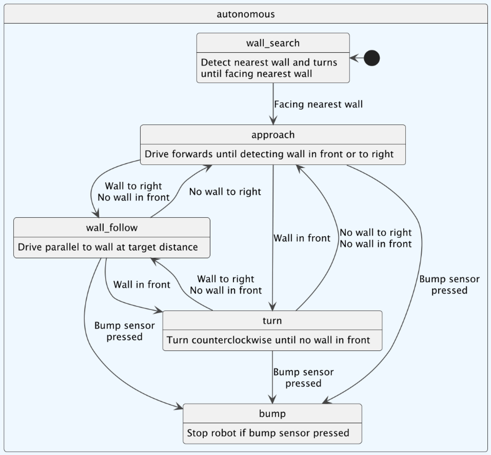
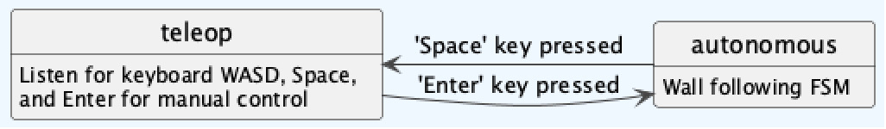

# RoboBehaviors-and-FSM
CompRobo 2025 - Ben Ricket, Connor Hoang

## Overview
This warmup project serves as an introduction to ROS2 and working with the Neatos for various tasks within a Python-based ROS2 development system. This project also served as an introduction to finite state machines (FSM) and the reactive control strategies inherent to our implementation. We utilized the following six behaviors for this project: teleop control, wall detection, wall approaching, turning, wall following, and stopping.
### List of Behaviors
1. Manual teleop control
2. Wall search (turn until facing nearest wall)
3. Wall approach (proportional approach velocity given distance to wall)
4. Turning until path ahead is clear
5. Wall following (fit line to wall, follow at distance)
6. Stop when bump sensor pressed
## Behaviors Implemented
### Overall Code Structure
<!-- check structure for tele-op first or after autonomous -->
The code for this project contained in two Python files. ```autonomous.py``` is structured into a singular ```NeatoFsm``` class that extends the ROS2 node. Inside the primary run loop of the node is a match case that explicitly checks for `approach`, `wall_follow`, `turn`, and `bump`, excluding the initial state ```wall_search```. A separate file ```simple_teleop.py``` effectively contains the `use_teleop` state. The `use_teleop` state is not encoded in the state attribute of the node, but rather in the `/use_teleop` ROS2 topic, directing the autonomous node to wait for the teleoperation node to relinquish control. In all autonomous cases, the robot queries LIDAR data from its sensor to detect whether a wall is present in front of it or to the side, executes logic based on its current state, and uses the data on wall presence to the front or right to execute any state change logic. For instance, if a wall is ever present close to and in front of the robot, the state changes to `turn`. 

<!-- Purpose behind structure -->
We choose this structure with simplicity and extendability in mind. While making each state its own node may have been cleaner for more complex FSMs, as we did between autonomous and teleop, a simple match case in the autonomous Python script allowed for easy addition of new cases and state control that we knew would be sufficient for the scope of this project. 
We chose this structure for its extensibility --- the overall logic is less neat and more complex than a state machine which uses PID velocity correction to account for all wall shapes, even sharp turns. However, encoding common behaviors like turning or approaching a wall into their own states leads to many options for extensibility --- the robot may want to turn sharply at a distance from an obstacle different than the distance it attempts to follow a wall at, for instance. Similarly, sharp turns can be performed in place with a dedicated `turn` state, whereas our current implementation of the `wall_follow` behavior constantly moves forwards while adjusting the angle of the robot. 



The transition from autonomous states to teleoperation is independent of what autonomous state the robot is in, and occurs when the `simple_teleop` node reads in a SPACE keypress from stdin. Pressing ENTER then enters autonomous mode again, beginning at `wall_search` as before. 



### Teleoperation
#### Logic
When specifically requested by the user, the robot should listen to velocity commands passed by keypresses on the terminal running the code. This helps drive the robot to a desired location when testing autonomous mode, exiting the `bump` state if the bump sensor is triggered, or for any other reason in which manual control of the robot would be useful.
#### Implementation
A separate node `simple_teleop` is initialized in another terminal. This node continually reads `stdin` to detect specific keypresses, which trigger the following logic: 

\[Space\]: pass True to `/use_teleop` informing the autonomous node to pause operation, and pass a zero-velocity command to `/cmd_vel` to stop the robot. 

\[Enter\]: pass False to `/use_teleop` informing the autonomous node to resume operation.

\[W\]: Publish velocity command for driving linearly forward <!-- check to make sure this is properly spaced into own lines-->

\[A\]: Publish velocity command for turning counterclockwise

\[S\]: Publish velocity command for driving linearly backward

\[D\]: Publish velocity command for turning clockwise

\['\x03'\] (SIGINT / Ctrl + C): Raise a KeyboardInterrupt to allow Ctrl+C to halt the program execution.

### Wall Search
#### Logic
When the wall following node is initialized, the robot should first identify the wall nearest to it. In this state, the robot uses its LIDAR scan data to detect the nearest wall and rotate until it is facing that wall or an equally close wall, before transitioning into an `approach` state. 
#### Implementation
This is achieved by accessing the entire contents of the last LIDAR scan, rather than sampling a specified range. To avoid sensor noise indicating a wall/obstacle is closer than it is in reality, `WALL_MIN_PTS` consecutive LIDAR scan ranges are checked simultaneously, and the maximum of these distances taken to be the distance to the wall in that direction. Of these distances, the minimum distance to an obstacle across the entire `ranges` array is used as the distance to a closest obstacle. 

After identifying this distance, the robot turns by calling the `turn` command, and checks if the difference between the distance to an obstacle in front of the robot and the minimum distance identified by the LIDAR scan is less than a specified tolerance (`WALL_SEARCH_TOLERANCE`). If this is the case, the robot is effectively facing the nearest wall, and can progress to the approach state.

Transitions: If the difference between the distance to a wall in front of the robot and the minimum distance to an obstacle is less than `WALL_SEARCH_TOLERANCE`, change state to `approach`.

A subscription to the `/bump` topic and corresponding callback changes the state to `bump` if the bump sensor ever outputs non-zero values, and sends a zero-velocity command to stop the robot. 

Issues: By using the maximum distance between `WALL_MIN_PTS` consecutive LIDAR readings as its metric of how close obstacles are in that direction, this implementation is effectively blind to any obstacles that, from the perspective of the LIDAR scanner, occupy less angular distance than the angle between the *n*th and the *(n + `WALL_MIN_PTS`)*th LIDAR scan rays. As we don't expect objects this thin to regularly occur or pose an issue to the robot, we consciously make this tradeoff, though `WALL_MIN_PTS` could be tuned to adjust this. <!-- check (n + WALL_MIN_PTS)th -->

Additionally, we currently only occupy this state after initializing the node, and are unable to return to it. Permitting the robot to return to this state can result in repeated behavior where the robot loses track of a wall on the right \(for instance, it drives past an object on the right, no longer detecting it\), has no idea of where a wall is, and turns back to the object, follows it briefly, and loses it again, becoming trapped in this behavior.

### Wall Approach
#### Logic
In the approach state, the Neato is attempting to close the distance between itself and the wall directly in front of it. It will slow down as it approaches the wall.
#### Implementation
This is achieved by setting an initial linear velocity ```Kp_drive``` that is multiplied by the difference between the distance in front of the Neato and the target distance (```approach_vel = self.Kp_drive * (dist_front - self.target_distance)```). The effect is a linear velocity that decreases proportionally as it approaches the wall. This approach velocity is bound to predetermined max and min velocites (```min(self.max_vel,max(self.min_vel,approach_vel))```) and sent to the ```drive``` function. Drive is a helper function that takes in arguments for linear and angular velocities which are then sent to the Neato.

Transitions: If distance in front of the Neato is less than `target_distance` change to state `turn`.

A subscription to the `/bump` topic and corresponding callback changes the state to `bump` if the bump sensor ever outputs non-zero values, and sends a zero-velocity command to stop the robot. 

### Turn
#### Logic
In the `turn` state, the Neato recognizes that there is an obstacle or wall in front of it, and turns counterclockwise until the path ahead is clear. If the path is clear and a wall is still present to the right of the Neato, it can move to the `wall_follow` state, following the wall to the right; otherwise, it recognizes it has lost the wall, and returns to `approach` in order to find the next wall.
#### Implementation
This is achieved by setting an angular velocity for turning, `self.max_ang_vel`, which is in turn set by the ROS2 parameter `max_ang_vel`, and passing this angular velocity to a `drive()` function that instructs the Neato to turn. In the current implementation, the turn is only counterclockwise --- while the `turn()` function called in this state takes a boolean argument for the direction of the turn, this is not actively used, as knowing whether a right or left turn is ideal requires tracking the distance from a wall both to the right and left of the robot, which we do not currently do. 

Transitions: After every iteration of the `turn` behavior, if the distance to the nearest wall in the front is greater than the target distance from a wall, then we assume the path in front of the robot is clear. At this point, if the distance to the nearest wall to the right of the robot is less than our `identify_wall_distance`, the distance at which we register a wall to our right, we register the wall to the right and transition to `wall_follow` in order to follow that wall. If the distance on the right is greater than `identify_wall_distance`, we have lost our wall, and return to `approach` in order to find another wall. 

A subscription to the `/bump` topic and corresponding callback changes the state to `bump` if the bump sensor ever outputs non-zero values, and sends a zero-velocity command to stop the robot. 

### Wall Follow
#### Logic
The Neato is attempting to drive parallel to the wall directly to its right.
#### Implementation
The ```wall_follow``` case starts by assuming a wall is already present to the right (condition for transitioning into this state.) LIDAR data from the right of the robot (`ANGLE_RIGHT_START` to `ANGLE_RIGHT_END` by default) is used to sample a number of LIDAR data points, where the minimum of the maximum distances in a sliding window of `WALL_MIN_PTS` points is used to avoid erroneously small readings due to sensor noise. After this filtered minimum is taken, the distances and angles of `WALL_MIN_PTS` points surrounding the closest point are converted to cartesian coordinates in the same LIDAR coordinate frame and passed to `wall_identify()` for principal component analysis. 
<!-- double check -->
We assume that the shape of the wall can be locally approximated with a straight line in the (x,y) plane, and that our data points approximate the shape of this wall. Given these assumptions, after centering the data points at the origin by subtracting out the mean, the first principal component `pc1` explains the most of the variance in the data point positions, corresponding to the direction of the wall. The second principal component `pc2` (equivalent to `pc1` rotated 90 degrees) therefore gives the unit normal to the wall. We flip the sign of `pc2` if it points away from the robot to ensure our target path is correct. We can use the NumPy linalg.svd functionality to calculate these components.

As we want to follow the wall maintaining a constant distance, the target path we follow is equivalent to the wall plus `pc2` scaled by our follow distance `target_distance`. The wall is equivalent to the line between the mean and the mean plus `pc1`. We create markers visualizing both the wall and our target path, and compute the robot's linear error from the target path by taking the scalar projection of the distance between the robot and a given point on the path (mean plus scaled `pc2`) onto the unit normal, giving us the perpendicular (closest) distance. 

In theory, this should be able to account for sharp turns given proper parameters. Sharp inwards turns would lead to a right-angle being described by a (albeit poorly fit) line angling inwards, driving the robot to turn in the proper way, whereas sharp outwards turns would yield the same line once the robot progressed far enough to sample past the corner. Because of this, we thought a linear fit to be justified and adequate for our use case.

The difference between the target path position and the robot position is used as the error in a PID controller which controls the angular velocity of the robot, helping it make adjustments in heading towards the path. The coefficients governing the PID controller, `kP`, `kI`, and `kD`, can be controlled by passing a three-element list of floats as the ROS2 parameter `/neato_fsm PID_controls`, with each element correspnding to the proportional, integral, and derivative coefficients respectively. 

Transitions:

A subscription to the `/bump` topic and corresponding callback changes the state to `bump` if the bump sensor ever outputs non-zero values, and sends a zero-velocity command to stop the robot.

### Bump
#### Logic
This state exists to hold the robot in place when the bump sensor publishes non-zero values to `/bump` while in autonomous mode. 

#### Implementation
A subscription to the `/bump` topic and corresponding callback changes the state to `bump` if the Neato's bump sensor ever outputs non-zero values, and sends a zero-velocity command to stop the robot. The only transition out of this state requires teleop command be enabled, the robot be driven away such that the bump sensor is no longer pressed, and teleop be disabled again, as exiting teleop enters the `wall_search` state by default. Ideally, the robot should not enter this state if the controls and parameters are tuned properly, though in practice this is not always the case. 

## Conclusion

### Takeaways
Working with valid LIDAR data was easier than we had initially anticipated --- our initial state machine layout assumed there would be times when the robot was too far from walls/obstacles to get good LIDAR readings, and would have to drive in a direction (`approach`) just to find a wall. In reality, testing the robot inside a classroom, the LIDAR data seemed to always identify a wall with relative consistency, leading us to implement the smarter `wall_search` state for identifying the nearest wall. In the future we will spend more time testing our equipment as part of the process for higher-level strategy and design.

We also made the initial assumption that we would use simple binary checks of wall presence in front and to the side of the robot rather than fitting a line or curve to define the shape of the detected wall, which ended up working passably, but was less easily extensible to make it more robust. This also required turning be a separate state not incorporated into the PID controller of the wall following behavior. In the future, we will have more experience in considering the tradeoffs of simplified (detection) systems to make more informed decisions.

To make the code more robust, we fit a line to the measured point on the wall such that sensor noise would play less of a large role on our measured error every iteration, leading to smoother behavior. Theoretically, a wide range of data points together with aggressive PID control could lead to sharp angles being approximated with increasingly angled lines, removing the need for a separate `turn` state; however, given the functionality of the state we had already implemented, it made sense to continue having `turn` be a separate state. In the future, we will consider combining behaviors for simplicity, while keeping in mind the flexibility afforded by allowing for some inefficiency.

Additionally, we spent most of our development time using the Gazebo simulator. While there were some discrepancies from the actual Neato's, the omni-reliability and customizability of the simulator and proved incredibly helpful when hardware was unavailable or we wanted to quickly test different environments. In the future, we will continue using simulators to their fullest while acknowledging the imperfections baked into any such model.

### Challenges
One of the challenges we faced throughout the project was tuning paramters. Specifically, the angle of the search cone that determined the distances from the robot and the coefficients in the wall following PID logic. 

Another challenge we encountered was how our initial state change and wall follow logic made no distinction between `target_distance`, the setpoint for our wall following PID controller, and the distance at which we registered a wall to the right of the robot as "detected" for the purpose of choosing to follow it or trying to find a new wall. This check was necessary to ensure the robot would not follow a wall while being far away from it, but by having this parameter be the same as the wall follow setpoint, any deviation away from the wall could trigger the `wall_follow` --> `approach` transition, rather than remaining in `wall_follow` and letting the PID controller handle the deviation. To address this behavior, we had to add an additional `identify_wall_distance` parameter, indicating a distance at which we recognize and intend to follow a wall even if it is greater than our ideal target distance. 

As a minor aside, structuring the code as a single ROS2 node effectively led to it being contained within a single Python class, relegating it to a single file, which made concurrent development a bit more annoying. This could have been avoided by writing some of the helper functions outside of the class itself, or using multiple ROS2 nodes, but the code for this project was short enough to not make this a significant issue. 

### Next Steps
Were we to develop this project further, the current code could benefit from an automated pipeline to tune the wall follow PID parameters. To achieve this, we could develop a Gazebo simulation to use specifically to test the wall follow performance, create a launch file initializing this simulation with the wall_follow behavior, and develop a metric to automatically measure the performance of the wall follow behavior and tune the parameters accordingly. 

Another possible extension of the work would be obstacle avoidance, either as a standalone state or integrated with wall following. For the latter, a forward lidar cone could be used to detect obstacles in the Neato's path and increase or decrease the target distance from the wall in order to avoid hitting the object.
### Attribution of Work
Ben led the integration of lidar sensors into the work, notably including the "wall determination" functionality and the wall search state.
Connor led the implementation of wall following given the sensor data and initial state machine logic.
Remaining work was distributed between members.

### Additional Documentation
Video and bag files are included in the repo as validation for the stated behaviors.
